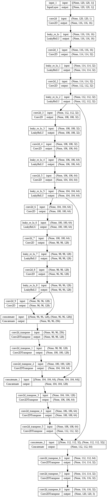
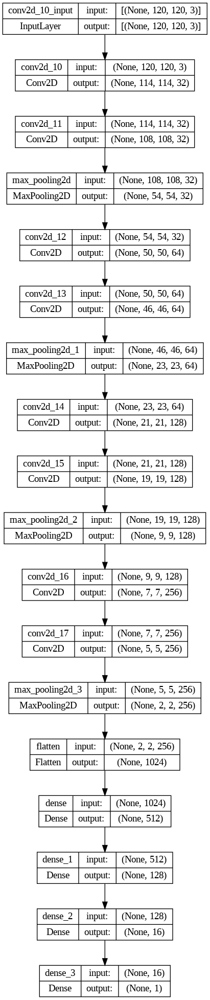
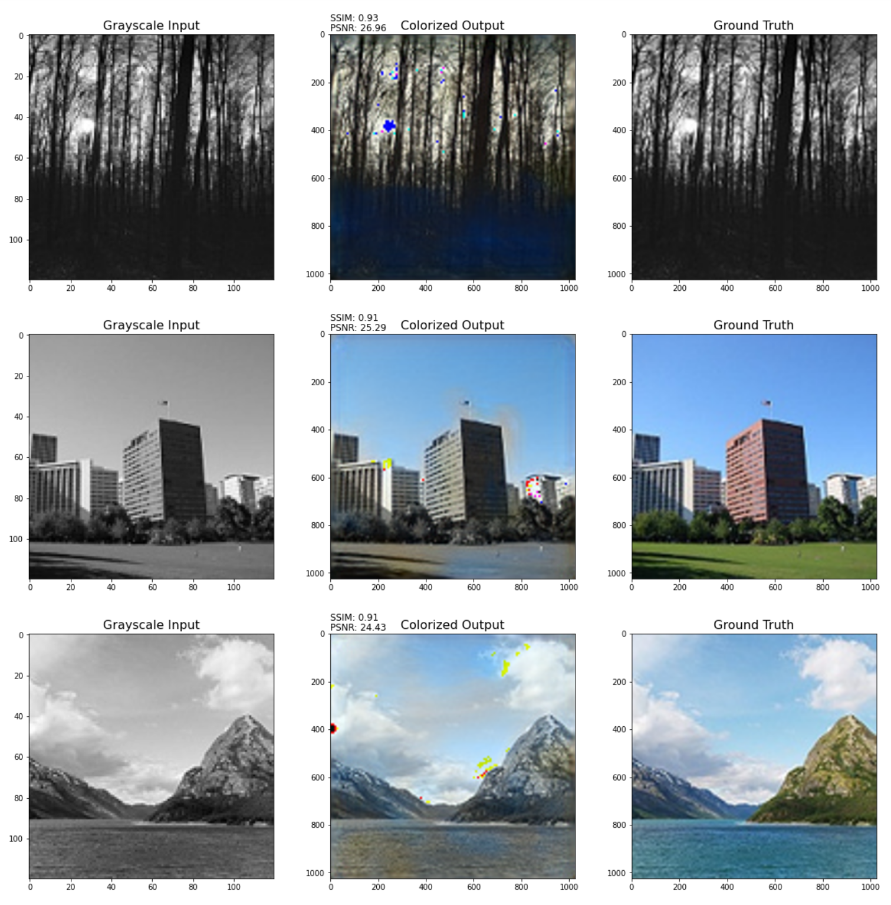

# BasicGAN

## 项目概述
实现了一个基于生成对抗网络（GAN）的图像彩色化模型。通过训练生成器和鉴别器，模型能够将灰度图像转换为彩色图像，并且输出的彩色化图像在PSNR和SSIM等指标上与原始彩色图像具有较高的相似度。
- 生成器（generator）结构

- 判别器（discriminator）结构

---
## 安装说明
- PIL（Python Imaging Library）：用于图像处理和操作。

    安装命令：!pip install pillow
- scikit-learn：用于数据集的划分。

    安装命令：!pip install scikit-learn
- TensorFlow：用于深度学习模型的构建和训练。

    安装命令：!pip install tensorflow
- NumPy：用于数组操作和数值计算。

    安装命令：!pip install numpy
- Matplotlib：用于图像显示和可视化。

    安装命令：!pip install matplotlib
- OpenCV：用于图像处理和计算机视觉任务。

    安装命令：!pip install opencv-python
---
## 使用示例

- 下载数据集：https://drive.google.com/file/d/1sl_-W_ZixZG6jZFSOlKEyGHhhv3gizCI/view?usp=sharing
- 运行:`ImageColorization_Basic_GAN.ipynb`
- 预测结果：
    第一列表示输入的灰度图，第二列是根据灰度图预测的彩色图，第三列为原始彩色图

---
## 配置选项

- batch_size: 控制训练过程中每个批次的样本数量。
- img_size: 训练模型所需的图像尺寸。输入图像将被调整为该尺寸进行训练。
- dataset_split: 数据集划分的数量，用于指定从主目录中加载的图像数量。
- master_dir: 主目录路径，该路径包含训练图像的子目录。
- num_epochs: 训练的总轮数。
