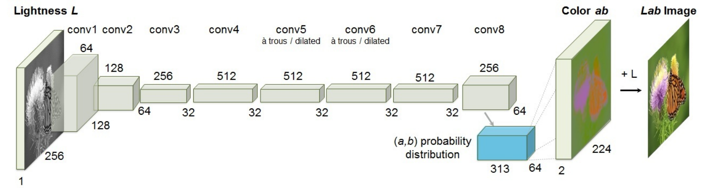
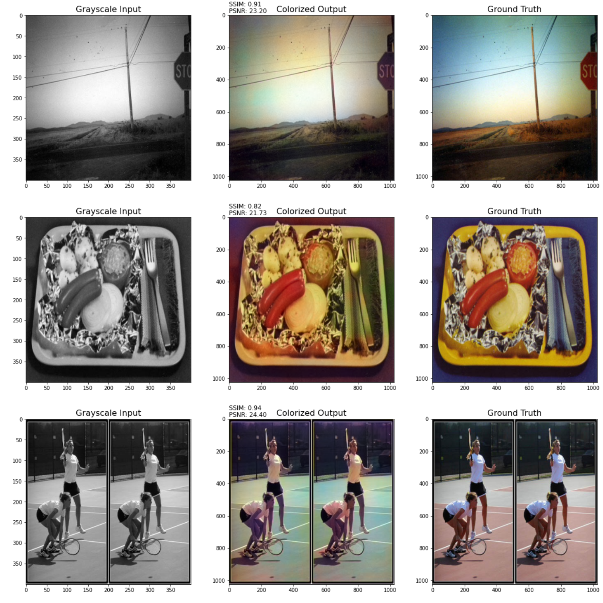

# ECVGAN

## 项目概述
- 本项目依旧使用GAN的思想；
- 在生成器的实现中，使用了ECCV16 Architecture，基于论文[Colorful Image Colorization](https://github.com/richzhang/colorization)中提出的方法，并通过使用生成对抗网络训练ECCV16 Architecture；

- 在判别器的实现依旧是简单的卷积神经网络；
- 此之外使用一个预训练的VGG19模型作为特征提取器，用于比较图像并使用该比较来计算损失。它接受两个图像作为输入，并提取出它们的第18层的激活值，然后使用RMSE、MSE等计算两个激活值之间的损失，使其能够生成更加逼真和与真实图像相似的结果。
- 数据来源[Kaggle](https://www.kaggle.com/aayush9753/image-colorization-dataset)
---
## 安装说明
- glob: 用于查找文件路径的模式匹配工具。

  安装命令：pip install glob2
- random: 用于生成随机数或随机选择元素。

  安装命令：pip install random2
- pandas: 提供数据分析和处理的工具，如数据结构和数据操作。

  安装命令：pip install pandas
- numpy: 提供高性能数值计算和数组操作的库。

  安装命令：pip install numpy
- matplotlib.pyplot: 提供绘制图表和可视化数据的函数。

  安装命令：pip install matplotlib
- PIL.Image: Python Imaging Library，用于图像处理和操作。

  安装命令：pip install Pillow
- argparse: 用于解析命令行参数和生成帮助信息的库。

  安装命令：pip install argparse
- torch: PyTorch深度学习框架的核心库。

  安装命令：pip install torch
- torchvision：专注于计算机视觉任务的扩展库。

  安装命令： pip install torchvision
---
## 使用示例
- 下载数据集到data文件夹
- 下载预训练模型：[pretrained_models ](https://drive.google.com/drive/folders/153PYVwK_6knKPpDJMhi3onojJdCVUlk2)到pretrained_models文件夹
- 运行`ECV_Gan_Training.ipynb`进行训练
  - `colorit_gan`文件夹内保存每轮训练结果，包括预测图像和对应的模型
- 运行`result.ipynb`进行预测
-   预测结果：
    第一列表示输入的灰度图，第二列是根据灰度图预测的彩色图，第三列为原始彩色图

---
## 配置选项

- start_epoch：训练的起始周期。
- n_epoch：总共的训练周期数。
- lr：学习率，控制模型参数更新的步长。
- b1和b2：Adam优化器的动量参数。
- decay_epoch：学习率衰减的周期数。
- in_channels：输入图像的通道数。
- out_channels：输出图像的通道数。
- sample_interval：每隔多少个批次进行一次样本的生成和保存。
- checkpoint_interval：每隔多少个周期保存一次模型的检查点。
- cuda：一个布尔值，表示是否可用CUDA加速。